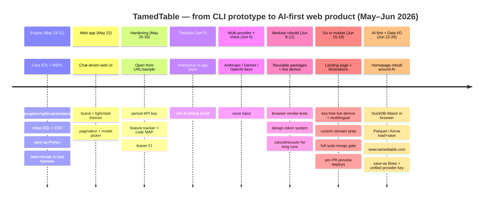

# Project history overview — PRs from inception

> Status report, 26 June 2026. A management/marketing-level map of what shipped,
> built from PR titles and merge history only (no source inspection).
>
> **Period covered:** 19 May 2026 → 26 June 2026 · **175 merged PRs** (#1–#184)
>
> **What TamedTable is:** a natural-language ETL tool. Load a CSV, type *"normalize
> phone numbers"* or *"drop duplicate emails,"* and an LLM rewrites a tiny JSON plan
> that the runtime replays against your data — so per-turn cost stays flat no matter
> how big the table is.

---

## Management / marketing overview

| Dates | PRs | Milestone | What shipped (in plain terms) |
|---|---|---|---|
| **May 19–21** | #1–#9 | **The engine works** | The core CLI/REPL ETL engine lands: group, join, split, validate, pivot/unpivot, in-line `{sql}`, and CSV output. Interactive REPL with navigation, search, and undo/redo. "Save as Python" export. Test infrastructure for recording & replaying AI calls so the suite is fast and deterministic. |
| **May 21–22** | #10–#14 | **It has a face** | The product goes from terminal-only to a **web app** — chat sidebar driving a live table view. A real brand arrives: light/dark themes, logo/favicon, pagination, status footer, and a model picker. |
| **May 25–27** | #15–#43 | **Hardening & process** | Open data from a URL or sample file; remember your API key in the browser. Heavy investment in *how the project runs itself*: a feature tracker, a code-navigation map, cleaner docs, and CI that link-checks and rebuilds only what changed. |
| **May 30** | #44–#46 | **Findability** | `MAP.md` and feature IDs woven through spec, tests, and source so any feature can be traced end to end. |
| **Jun 5** | #47–#63 | **Guided tutorials** | An interactive, in-app **Tutorial mode** that walks new users through real tasks, plus a richer debug panel that shows what the AI actually did each turn. |
| **Jun 6** | #64–#76 | **More AI, and your voice** | Multi-provider AI: bring your own **Anthropic, Google Gemini, or OpenAI** key. **Voice input** — talk to your table instead of typing. |
| **Jun 8–11** | #77–#101 | **Built to last** | The app is broken into clean, reusable building blocks (file-io, table view, chat panel, voice, toolbar, model config, UI kit), each with its own live demo and browser smoke tests. Voice round-trips end to end. |
| **Jun 12** | #102–#116 | **Design system & reliability** | A single source of truth for colors/typography (design tokens). Robust cancel-and-recover behavior for long SQL/AI runs. One-command setup. |
| **Jun 15–18** | #117–#145 | **Going to market** | A real **marketing landing page** with 10+ on-brand illustrations, an animated demo, multilingual support, and **key-free live demos** so anyone can try it instantly. Homepage published at the site root; BYOK setup guide; CLI `--version`; an issue-driven "label it and an agent builds it" workflow. |
| **Jun 19** | #147–#160 | **Quality gates & previews** | Full test suite now blocks merges. **Per-PR preview deployments** so every change can be seen live before merge. FAQ page; reusable, host-agnostic guided-tour engine. |
| **Jun 22–24** | #163–#172 | **AI-first repositioning** | The homepage is rebuilt around the AI features as the headline. Multiregion hero, new illustrations, and a big internal cleanup/renaming pass (the data "Spec" becomes the clearer **TablePlan**). |
| **Jun 25–26** | #173–#184 | **Serious data I/O & polish** | **DuckDB in the browser** re-enables SQL on the web and adds **Parquet / Arrow** load & save. Custom domain **www.tamedtable.com**. In-app diagnostics + one-click bug report. Save-as flows (data, flow, Python) and a single provider key that drives the whole app. |

### Headline takeaways

- **5½ weeks, 175 merged PRs** — from a terminal prototype to a branded, AI-first web product on its own domain.
- **Three big arcs:** (1) build the engine → (2) put a polished web face on it → (3) make it AI-rich (multi-provider + voice), modular, and market-ready.
- **Quality was engineered in, not bolted on:** deterministic AI tests, a feature-tracing map, a full-suite merge gate, and per-PR live previews.
- **Try-before-you-buy by design:** key-free live demos and an in-browser app mean zero install, zero signup to evaluate.

---

## Timeline diagram

